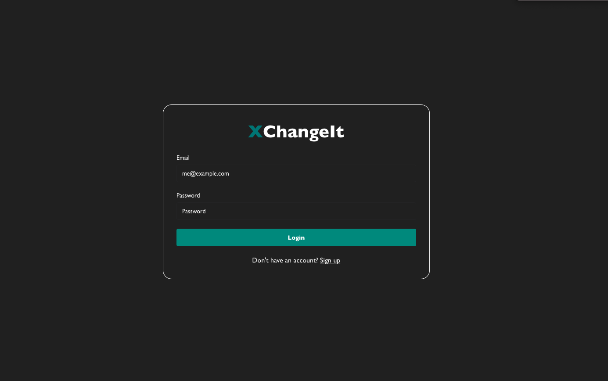
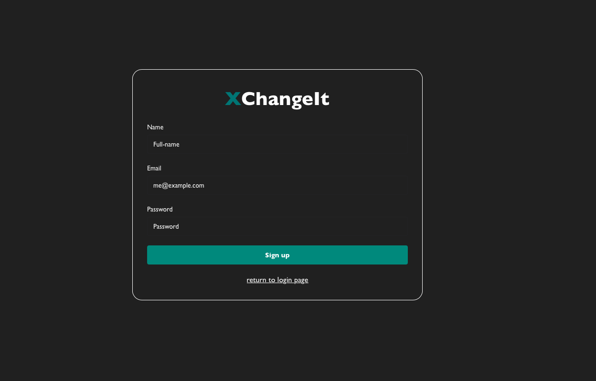
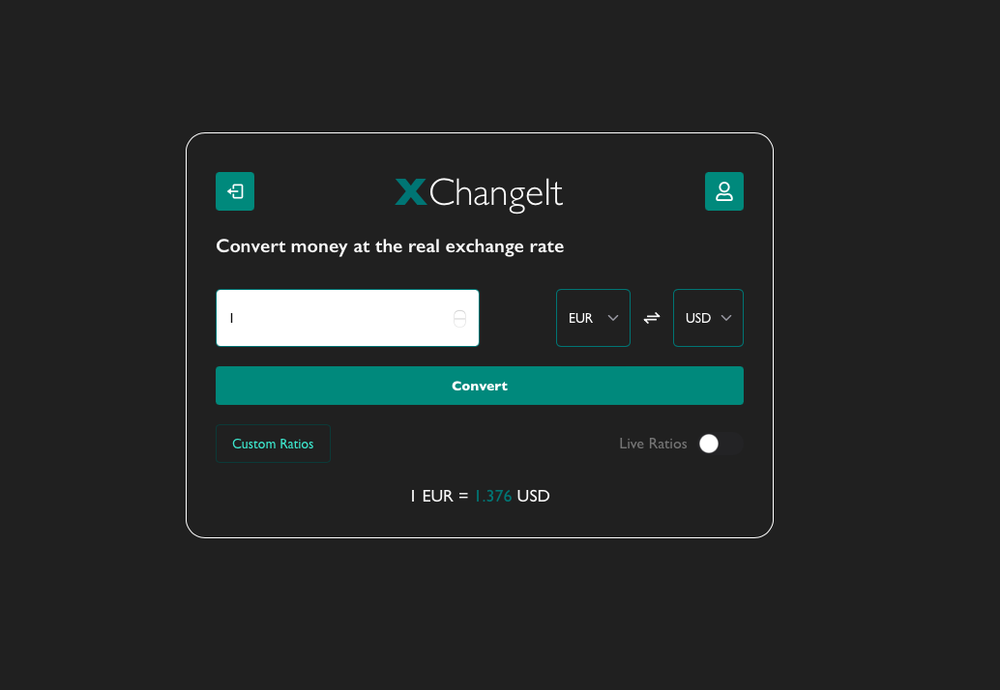
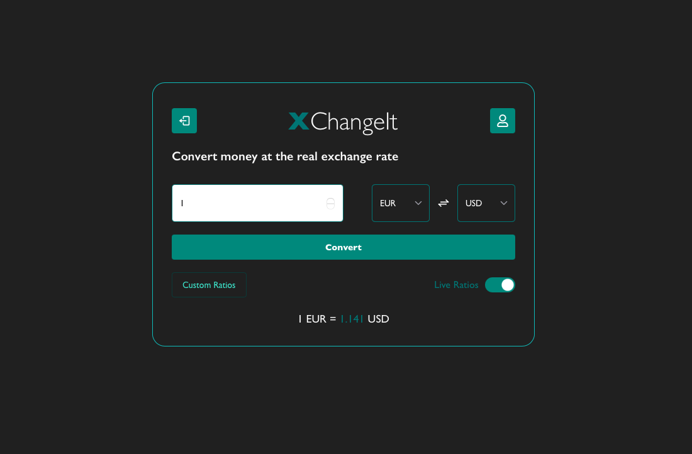
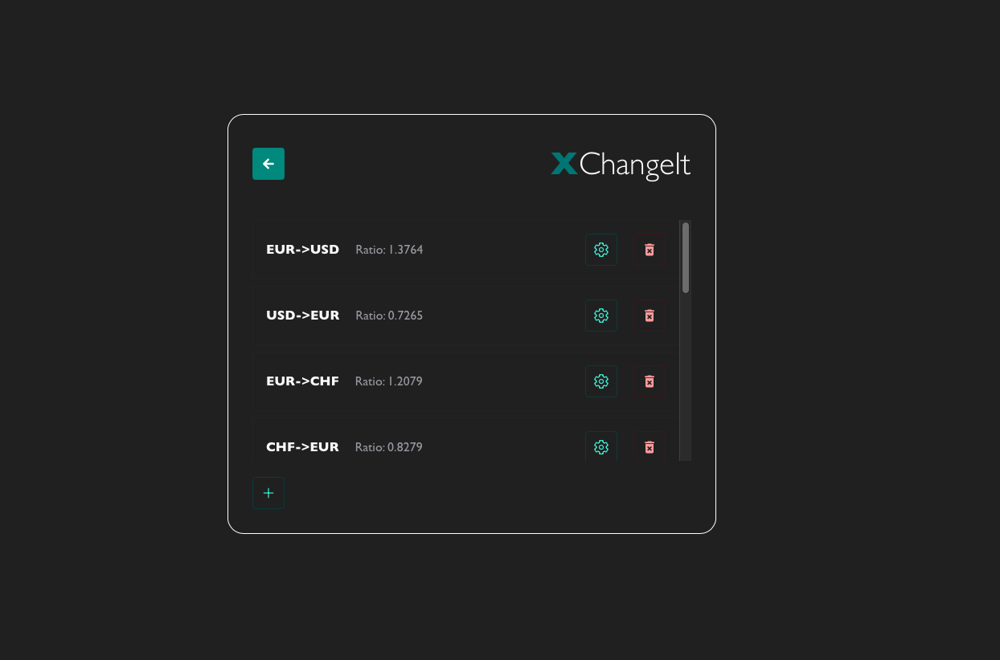
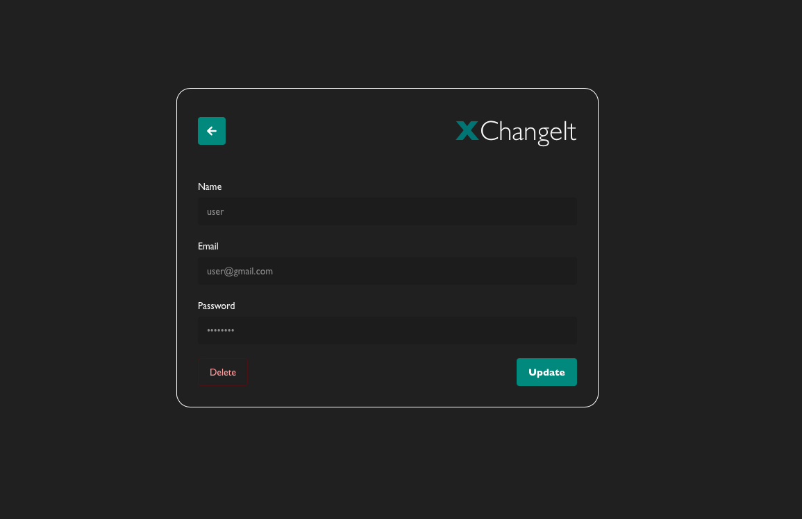

# XChangeIt – Currency Converter Web App

## 🚀 About Exchange

**XChangeIt** is a modern currency converter web application that allows users to manage and convert currencies using both **custom and live exchange rates**. Built with full-stack technologies, this app provides a secure and responsive interface for personal currency management.

## 🛠 Tech Stack
- Frontend: React + Chakra UI
- Backend: Node.js + Express
- Database: MongoDB
- Authentication: JWT + bcrypt

## 🎯 Project Goals

- Allow users to **register and log in** securely.
- Enable custom **currency ratio creation, update, and deletion**.
- Provide **live exchange rates** using external APIs.
- Offer a complete **user profile management** experience.
- Ensure security using **JWT authentication** and **bcrypt hashing**.

## ✨ Features

- 🔐 **Authentication System** – Secure sign-up and login using JWT and bcrypt.
- 🔁 **Custom Conversion Ratios** – Create, update, and delete conversion rates.
- 💱 **Live Currency Data** – Fetch and use real-time rates from an external API.
- 👤 **User Profile** – View, update, or delete personal information.
- 📊 **Convert Currencies** – Input an amount and apply any selected ratio.
- 📱 **Responsive UI** – Built with Chakra UI and React for modern feel and mobile friendliness.

## 📸 Screenshots

### 1️⃣ Login Page


*Users can securely log in to access their currency tools.*
<br>
### 2️⃣ Sign Up Page


*New users can register an account securely.*
<br>
### 3️⃣ Conversion Panel


*Users input an amount and select a custom ratio to perform conversion.*
<br>
### 4️⃣ Live Rates Panel


*Fetches and displays up-to-date currency rates from an external API.*
<br>
### 5️⃣ Manage Ratios Panel


*Create new conversion ratios between currencies, or update/delete existing ones.*
<br>
### 6️⃣ Profile Panel


*View or edit personal data like name and email, or delete the profile.*
<br>
## 🛠️ Installation

To run this project locally:

```sh
# Clone the repository
git clone https://github.com/kostasmr/XChangeIt.git

# Set up environment variables (.env)
# Example:
# JWT_SECRET=your_secret
# MONGO_URI=your_database_uri

# Install frontend dependencies
cd frontend
npm install vite --save-dev

# Start both servers (frontend and backend)
cd frontend
npm start

cd backend
npm start

# Go to http://localhost:5173 and make an account
```

<br>
<br>
🌟 If you like Exchange, consider giving it a star on GitHub! ⭐
